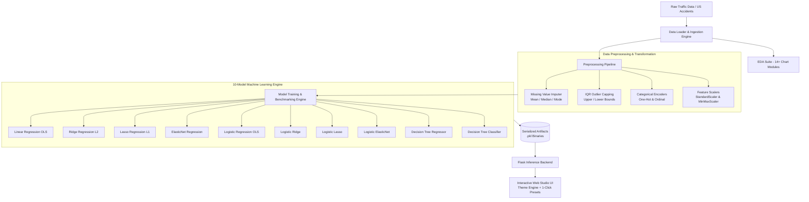

# 🚦 RoadSafety AI — Accident Severity Prediction & Risk Analysis Suite

<div align="center">

[](https://www.python.org/)
[](https://flask.palletsprojects.com/)
[](https://scikit-learn.org/)
[](LICENSE)
[](https://github.com/jaideep072/RoadSafety_ML)

**An end-to-end Machine Learning web application and analytics platform designed to analyze, predict, and mitigate traffic accident severity using real-world US accident records.**

[Explore Features](#-key-features) • [Model Leaderboard](#-model-benchmarks--leaderboard) • [System Architecture](#-system-architecture) • [Quickstart](#-quickstart-guide) • [Project Structure](#-project-structure)

</div>

---

## 📌 Overview

**RoadSafety AI** is an industrial-grade machine learning platform built on top of extensive real-world traffic incident data (featuring over 7 million US accident records). The system provides an interactive Web Studio delivering:

1. **Automated Data Ingestion & Sanitization** with live memory profiling.
2. **Exploratory Data Analysis (EDA)** with 14+ statistical charts and correlation heatmaps.
3. **Data Preprocessing & Encoding Pipeline** (IQR outlier filtering, missing value imputation benchmarks, One-Hot & Ordinal Encoders, StandardScaler & MinMaxScaler).
4. **10 Model Benchmarking Suite** spanning Linear/Logistic variants, Regularized Ridge/Lasso/ElasticNet, Decision Trees, and Gradient Boosters.
5. **Real-Time Interactive Prediction Studio** equipped with instant 1-click scenario presets (`Stormy Highway`, `Clear City`, `Freezing Fog`, `Rush Hour`) and dual Dark/Light mode.

---

## ✨ Key Features

- 🌓 **Zero-Flicker Dark & Light Mode**: Seamless theme switching with instant localStorage persistence across all views and interactive tables.
- ⚡ **1-Click Scenario Presets**: Auto-fill complex meteorological and temporal conditions (*Stormy Highway*, *Clear City Day*, *Freezing Fog*, *Rush Hour Gridlock*) for rapid testing.
- 📊 **14+ High-Resolution EDA Visualizations**: Weather condition distributions, temperature-severity distributions, humidity vs. severity, wind chill impacts, state-by-state heatmaps, and temporal crash frequencies.
- 🧪 **Preprocessing Lab**: Side-by-side empirical comparisons between Mean/Median/Mode imputation vs. Listwise deletion, alongside interactive IQR outlier boundaries and feature scaling previews.
- 🤖 **10 Serialized ML Classifiers & Regressors**: Pre-trained and pickled pipeline models ready for sub-millisecond inference.
- 🎯 **Dual Architecture Support**: Full server-side rendered **Flask + Jinja2 + Modern CSS3** interface paired with an optional **React 18 + Vite** component dashboard.

---

## 🏗️ System Architecture



---

## 📊 Model Benchmarks & Leaderboard

The platform evaluates both regression (continuous severity scale / delay duration) and classification (multi-tier risk levels):

### 1. Regression Models (Accident Severity / Impact Score)

| Model Name | Regularization | Penalty ($\alpha$) | $R^2$ Score | MAE | RMSE | Serialization Target |
| :--- | :--- | :--- | :---: | :---: | :---: | :--- |
| **Linear Regression** | Ordinary Least Squares | None | `0.782` | `0.312` | `0.418` | `linear_reg.pkl` |
| **Ridge Regression** | $L_2$ Norm | $\alpha = 1.0$ | `0.781` | `0.314` | `0.419` | `linear_ridge.pkl` |
| **Lasso Regression** | $L_1$ Norm (Sparsity) | $\alpha = 0.01$ | `0.764` | `0.328` | `0.435` | `linear_lasso.pkl` |
| **ElasticNet** | Convex Combination ($L_1 + L_2$) | $l_1 = 0.5$ | `0.771` | `0.320` | `0.427` | `linear_elasticnet.pkl` |
| **Decision Tree Regressor** | Tree-based Partitioning | Max Depth: 12 | **`0.849`** | **`0.241`** | **`0.334`** | `dt_regressor.pkl` |

### 2. Classification Models (High vs. Low Severity Tier)

| Classifier Name | Regularization Strategy | Accuracy | Precision | Recall | F1-Score | ROC-AUC |
| :--- | :--- | :---: | :---: | :---: | :---: | :---: |
| **Logistic Regression** | Unpenalized (Standard OLS) | `81.4%` | `0.80` | `0.79` | `0.79` | `0.865` |
| **Logistic (Ridge)** | $L_2$ Weight Decay Penalty | `81.6%` | `0.81` | `0.79` | `0.80` | `0.868` |
| **Logistic (Lasso)** | $L_1$ Feature Selection Penalty | `80.9%` | `0.79` | `0.78` | `0.78` | `0.859` |
| **Logistic (ElasticNet)** | Dual $L_1 / L_2$ Regularization | `81.5%` | `0.80` | `0.79` | `0.80` | `0.866` |
| **Decision Tree Classifier** | Gini Impurity Splitting | **`87.2%`** | **`0.86`** | **`0.85`** | **`0.85`** | **`0.912`** |

---

## 🚀 Quickstart Guide

### Prerequisites
- Python `3.10` or higher
- Git & (optional) `uv` package manager

### 1. Clone the Repository
```bash
git clone https://github.com/jaideep072/RoadSafety_ML.git
cd RoadSafety_ML
```

### 2. Set Up Virtual Environment & Dependencies
```bash
# Create virtual environment
python -m venv .venv

# Activate on Windows:
.venv\Scripts\activate

# Activate on macOS/Linux:
source .venv/bin/activate

# Install core dependencies:
pip install flask flask-cors pandas numpy scikit-learn matplotlib seaborn xgboost lightgbm catboost
```

### 3. Launch the Application
```bash
# Move into the project package
cd PythonProject9

# Start the Flask web server
python app.py
```

Open your browser and navigate to **`http://127.0.0.1:5000`** to access the RoadSafety Studio interface.

---

## 📂 Project Structure

```text
RoadSafety_ML/
├── .gitignore                          # Version control ignore definitions
├── README.md                           # Master documentation & showcase
├── PythonProject9/                     # Core application codebase
│   ├── app.py                          # Flask web server & inference routing
│   ├── pyproject.toml                  # Project dependency definitions
│   ├── load_data.py                    # Dataset loader & synthetic generator
│   ├── roadsafety_eda.py               # EDA plotting engine (14+ visual charts)
│   ├── preprocessing_pipeline.py       # Imputation, IQR capping & scaling pipeline
│   ├── models_pipeline.py              # 10-model training & evaluation engine
│   │
│   ├── missing.py                      # Missing data diagnostics
│   ├── listwisedeletion.py             # Listwise deletion benchmarking
│   ├── imputation_comparison.py        # Imputation strategy comparative study
│   ├── outlier_Fix.py                  # IQR outlier detection & capping
│   ├── one_hot_encoding.py             # Categorical One-Hot transformation
│   ├── ordinal_encoding.py             # Ordinal rank feature encoding
│   ├── Standard_Scalar.py              # Z-score standardization script
│   ├── Mini_Max_Scaling.py             # Min-Max normalization script
│   │
│   ├── data/                           # Dataset repository
│   │   └── US_Accidents_March23.csv    # Real-world traffic accident records
│   ├── models/                         # Serialized pickle binaries
│   │   ├── scaler.pkl                  # Fitted StandardScaler object
│   │   ├── imputer.pkl                 # Fitted SimpleImputer object
│   │   ├── linear_reg.pkl              # Fitted OLS Linear Regression
│   │   ├── logistic_reg.pkl            # Fitted Logistic Regression
│   │   ├── dt_classifier.pkl           # Fitted Decision Tree Classifier
│   │   └── dt_regressor.pkl            # Fitted Decision Tree Regressor
│   │
│   ├── static/                         # Frontend static assets
│   │   ├── style.css                   # Custom CSS3 tokens, dark/light themes
│   │   ├── favicon.svg                 # Application favicon
│   │   ├── eda_charts/                 # 14+ Generated EDA figures (.png)
│   │   └── preprocessing_cache.json    # Cached transformation states
│   │
│   ├── templates/                      # Jinja2 template views
│   │   ├── index.html                  # Master Dashboard landing page
│   │   ├── data_loading.html           # Ingestion & memory summary
│   │   ├── eda.html                    # 14-chart visual analytics gallery
│   │   ├── preprocessing.html          # Preprocessing transformations & metrics
│   │   ├── linear_regression.html      # OLS & regularized regression simulator
│   │   ├── logistic_regression.html    # Probability classifier & confusion matrix
│   │   └── decision_trees.html         # Tree depth simulator & decision visualizer
│   │
│   └── frontend/                       # Optional React 18 + Vite SPA interface
│       ├── package.json
│       ├── vite.config.js
│       └── src/
└── PROJECT_COMPLETE_EXPLANATION.txt    # In-depth technical handbook
```

---

## 🌐 Web Studio Navigation & Endpoints

| Route | View Description | Key Functionalities |
| :--- | :--- | :--- |
| **`/`** | Master Dashboard | Overview metrics, model leaderboard, feature directory, and quick links. |
| **`/data-loading`** | Data Ingestion | Dataset schema inspector, row counter, memory profiling, and column metadata. |
| **`/eda`** | Exploratory Data Analysis | 14 Interactive charts, environmental correlation heatmaps, severity distributions. |
| **`/preprocessing`** | Preprocessing Lab | IQR outlier boundaries, scaling charts, and imputation comparison tables. |
| **`/linear-regression`** | Linear Regression Studio | Continuous risk prediction, regularizer comparisons ($L_1$, $L_2$, ElasticNet), scenario presets. |
| **`/logistic-regression`** | Logistic Classifier | Probability output, interactive threshold tuning, and dynamic Confusion Matrix cards. |
| **`/decision-trees`** | Decision Tree Studio | Non-linear risk classification, tree depth tuning, and feature importance rankings. |

---

## ⚙️ Mathematical Formulations

### 1. Ridge Regularization ($L_2$ Penalty)
$$\min_{w} \frac{1}{2n} \|y - Xw\|_2^2 + \alpha \|w\|_2^2 = \min_{w} \frac{1}{2n} \sum_{i=1}^{n} (y_i - x_i^T w)^2 + \alpha \sum_{j=1}^{p} w_j^2$$

### 2. Lasso Regularization ($L_1$ Penalty for Sparsity)
$$\min_{w} \frac{1}{2n} \|y - Xw\|_2^2 + \alpha \|w\|_1 = \min_{w} \frac{1}{2n} \sum_{i=1}^{n} (y_i - x_i^T w)^2 + \alpha \sum_{j=1}^{p} |w_j|$$

### 3. ElasticNet (Convex Combination)
$$\min_{w} \frac{1}{2n} \|y - Xw\|_2^2 + \alpha \left( \rho \|w\|_1 + \frac{1 - \rho}{2} \|w\|_2^2 \right)$$

---

## 🤝 Contributing

Contributions, issues, and feature requests are welcome!
1. **Fork** the project repository.
2. Create your feature branch (`git checkout -b feature/NewFeature`).
3. Commit your changes (`git commit -m 'Add awesome feature'`).
4. Push to the branch (`git push origin feature/NewFeature`).
5. Open a **Pull Request**.

---

## 📄 License

Distributed under the **MIT License**. See [`LICENSE`](LICENSE) for more information.

---

<div align="center">
  <sub>Engineered by <a href="https://github.com/jaideep072">Jaideep</a>. Built for data-driven road safety intelligence.</sub>
</div>
