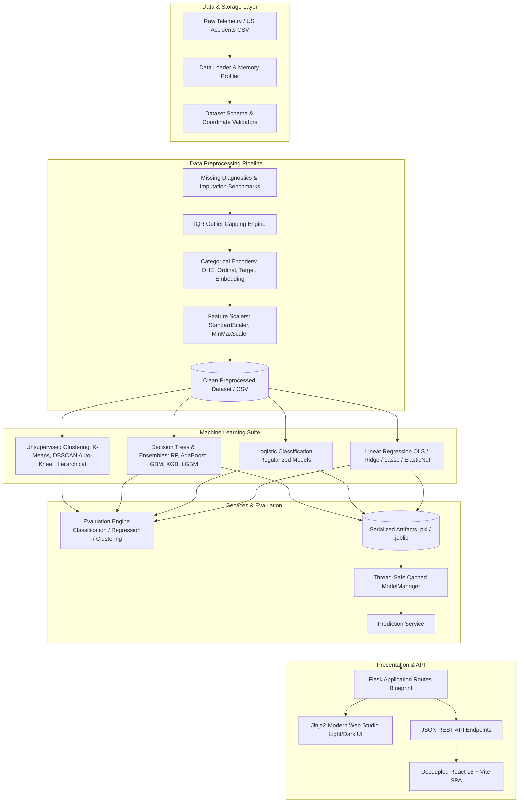

# System Architecture

## Overview

**RoadSafety_ML** is engineered with a clean, decoupled, layered architecture separating data ingestion, preprocessing, modeling, evaluation, artifact caching, and web presentation.

---

## Directory Organization & Responsibilities

| Directory | Primary Responsibility |
| :--- | :--- |
| `app/` | Core application package containing configuration, routes, and business logic. |
| `app/data/` | Dataset loader, memory optimization, synthetic generator, and schema validators. |
| `app/preprocessing/` | Leakage-free preprocessing, missing values diagnostics, IQR outliers, encodings, and scalers. |
| `app/models/` | Supervised model definitions, training pipelines, and prediction functions. |
| `app/clustering/` | K-Means, DBSCAN with automated Knee eps detection, Hierarchical dendrograms, and Geographic mapping. |
| `app/evaluation/` | Unfabricated metrics calculation for regression ($R^2$, RMSE, MAE), classification (Accuracy, Precision, Recall, F1, ROC-AUC), and clustering (Silhouette, Davies-Bouldin, Inertia). |
| `app/services/` | Thread-safe, cached `ModelManager` and centralized `PredictionService`. |
| `app/templates/` | Jinja2 templates featuring responsive layouts, zero-flicker Dark/Light themes, and interactive forms. |
| `app/static/` | CSS stylesheets, SVG assets, and generated analytics figures. |
| `data/` | Raw and preprocessed CSV datasets isolated from source code. |
| `artifacts/` | Serialized model objects, scalers, and encoders. |
| `scripts/` | Standalone CLI runners for training, preprocessing, and clustering. |
| `tests/` | Pytest automated test suite covering all units, pipelines, routes, and error handlers. |
| `docs/` | Comprehensive technical, algorithmic, API, and development documentation. |

---

## Caching Strategy

To ensure sub-millisecond page response times and eliminate redundant disk reads or CPU-heavy re-computations:
1. **ModelManager In-Memory Cache**: Models and scalers are loaded once upon first access and retained in memory using thread-safe synchronization.
2. **Preprocessing JSON Cache (`static/preprocessing_cache.json`)**: Preprocessed previews and statistics are cached for instantaneous dashboard rendering.
3. **EDA JSON Cache (`static/charts/results_cache.json`)**: High-resolution chart references and dataset summaries are persisted.
4. **Models Benchmark Cache (`static/models_cache.json`)**: Leaderboard benchmarking metrics are cached after pipeline runs.
